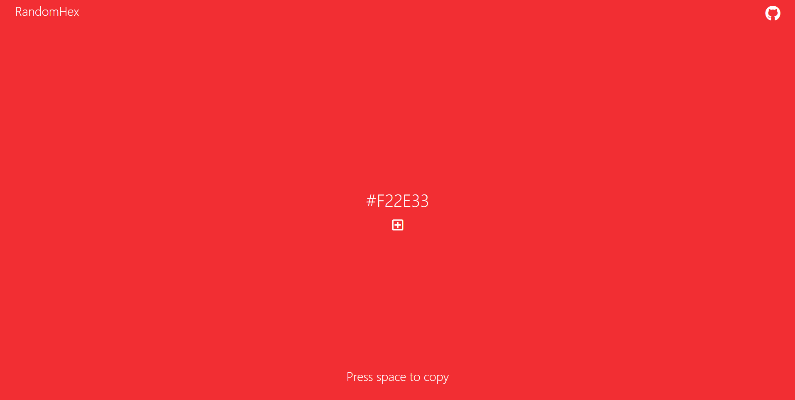

   
# Color-Randomizer

A web application that randomized a HEX color for building color palettes. 
Build in React. 

## Go to the Website
https://hexcolor-randomizer.netlify.app/

## Screen Shots

## Technologies Used

* React
* Node.js
* npm
* Yarn
* JavaScript ES6, HTML, and CSS
