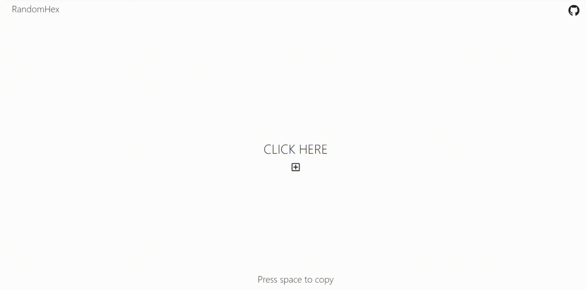

   
# Random-Hex-Color

An aesthetic web application that generates random three-byte hexadecimal numbers for building web color pallets using React.js.

## Go to the Website
https://randomhex-color.netlify.app/

## Screen Shots

## Technologies Used

* React
* JavaScript 
* HTML
* CSS
